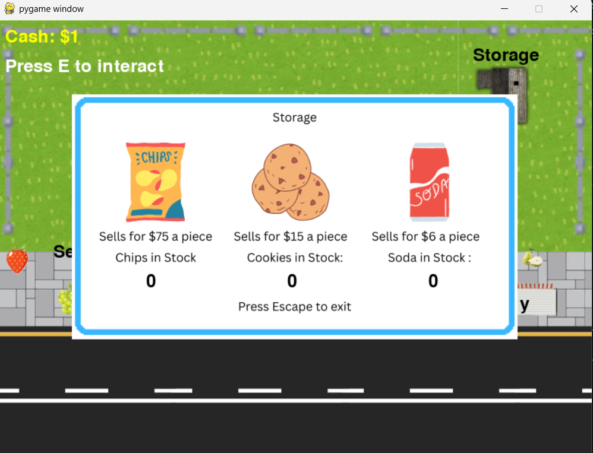

# Snack Shop

A simple **top-down tycoon-style game** built with **Pygame**.  
You can move your character around, collect coins from the coin farm, buy snacks from NPCs, and sell them to consumers for a profit.
The goal is to manage your cash by farming coins, trading goods, and avoid the obstacles while playing.

## Table of Contents

- [About](#about)
- [Features](#features)
- [Installation](#installation)
- [How to Play](#how-to-play)
- [Screenshots](#screenshots)
- [Download](#download)
- [Contributing](#contributing)
- [License](#license)
- [Contact](#contact)

## About

Snack Shop is a desktop application that allows the player to run around and make money. The game was inspired by tycoon style games and is really fun to play
Unlike modern day games that often use powerful game enignes and require strong cpu/gpu to run this is a simple game that just requries python to play.

# Features

- Character Movement (WASD/arrow keys)
- Collisions
- Coin Farm where coins spawn every 60 secs
- Lightweight and runs on most Windows PCs (requires Python 3)
- Cooldown system to prevent accidental double buy.
- Easy to install and launch with no ads or distractions

## Installation

### Requirements

- Python 3.x
- Pygame (included in .exe file so you don't need to worry about this)

### Running from source
1. Download .exe file from github releases
2. Make sure you have Python 3 isntalled
3. Navigate to downloads or where ever the .exe file is downloaded
4. Open the .exe file to run the code
5. Enjoy!

## How to Play

- Use WASD to move around
- Buy stuff from store with money/coins
- Store items in storage
- Sell them for a profit
- Repeat and get rich!

## Controls

| Key              | Action                                         |
|------------------|------------------------------------------------|
| **W/UP Key**     | Move Up                                        |
| **S/Down Key**   | Move Down                                      |
| **A/Right Key**  | Move Right                                     |
| **D/Left Key**   | Move Left                                      |
| **E**            | Interact with NPC, Stall, or Storage           |
| **1 / 2 / 3**    | Buy Chips / Cookies / Soda (when shop is open) |
| **ESC**          | Close Shop and Storage                         |
| **Close Window** | Exit Game                                      |

## Screenshots

## Contributing

Contributions are welcome! If you want to add features, fix bugs, or improve UI, please open an issue or submit a pull request.

## License

This project is licensed under MIT License - see [LICENSE](/LICENCE) for details

## Contact

Developed by Kush/Kcoder:

GitHub: [https://github.com/kushmdesai](https://github.com/kushmdesai)

Project Repo: [https://github.com/kushmdesai/snack-shop-tycoon](https://github.com/kushmdesai/snack-shop-tycoon)

## Credits

Thanks you for checking out Retro Checkers it was developed because of [Hackclub's Summer Of Making](https://summer.hackclub.com) so a special thanks to them! Check out my project on [Summer Of Making](https://summer.hackclub.com/projects/11162) as well!